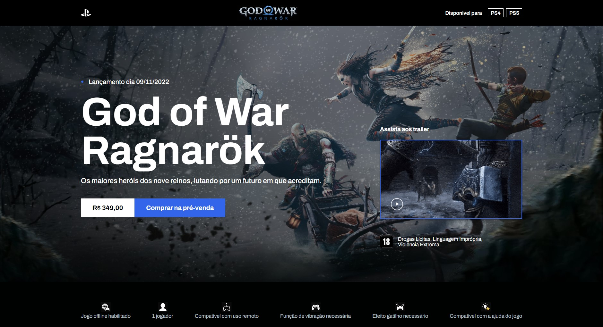

<h1 align="center"> God of War Ragnarök </h1>

Projeto desenvolvido durante o evento DEV.PROCESS oferecido pela Codeboost

  <a href="#-tecnologias">Tecnologias</a>     |    
  <a href="#-projeto">Projeto</a>     |    
  <a href="#-layout">Layout</a>     |    
  <a href="#memo-licença">Licença</a>

  

 

  

##  🚀 Tecnologias

Esse projeto foi desenvolvido com as seguintes tecnologias:

- HTML
- SASS
- JavaScript

##  💻 Projeto

O projeto apresenta uma interface para o jogo God of War Ragnarök da Sony/Playstation. Nele está apresentado um pouco da história do jogo e de alguns personagens.

##  🔖Layout

Você pode visualizar o layout do projeto através de [ DESSE LINK ](https://www.figma.com/file/BPHOdrrzDnuvKPurADmIsW/Codeboost---God-of-War-Ragnarok?node-id=0%3A1&t=x0igKrsERNUB2qFL-1 ). É necessário ter conta no [ Figma ](https://figma.com) para acessá-lo.

## : memo : Licença 

Esse projeto está sob a licença MIT.